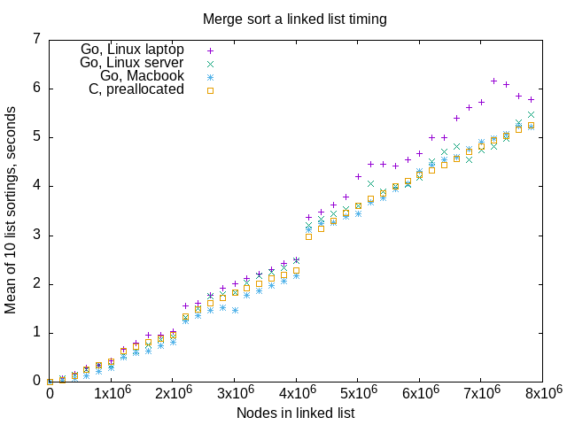

# Linked List Interview Questions

A compendium of linked list developer interview questions in Go

[Why Do Interviewers Ask Linked List Questions?](https://hillelwayne.com/post/linked-lists/)
Why, to see if the candidate could write working code in C.
Linked list problems are past their freshness date for that purpose.

I wrote a Go [linked list package](list) to provide a framework
for creating linked lists from textual representations,
and printing outputs.

I wrote a [doubly-linked list package](dllist) towards the same end.
It's not as fully realized.

Both of these packages only have integer-valued list nodes.
There's absolutely no reason to use these packages except
when developing answers to interview questions.

## Building

```go
$ go build cp.go
$ go build merge.go
$ go build stk.go
$ go build queue.go
$ go build reverse.go
...
```

More files than above exist in this repo.
Most of the programs depend on the `list` package,
or the `dllist` package,
and sometimes the `heap` package (all in this repo)
but nothing more.

---

## Build a LIFO, a stack, from a linked list

[Code](stk.go)

```
$ ./stk 1 10 2 0
Empty: true
0 2 10 1 
```
---

## Daily Coding Problem: Problem #443 [Medium] 

This problem was asked by Apple.

Implement a queue using two stacks.
Recall that a queue is a FIFO (first-in, first-out)
data structure with the following methods:
enqueue, which inserts an element into the queue, and dequeue, which removes it.

```
$ ./queue 1 2 3 4 5
1 2 3 4 5
```

### Analysis

[Code](list/queue.go)

This is Old School.
As far as I know, there's only one way to do this.
I'll refer to the two stacks as "enqueue stack" and "dequeue stack".
On a dequeue, if the dequeue stack is empty,
pop each element off the enqueue stack and push it on the dequeue stack,
leaving the enqueue stack empty.
On an enqueue, push the item on the enqueue stack.

If the candidate doesn't know this one, the problem is worthless.
Even if the candidate knows the answer, it's just some easy stack manipulation.
Pushing or popping an item from the head of a list is about as basic as things come.

The Chris Okasaki paper
[Simple and efficient purely functional queues and deques](https://www.cambridge.org/core/journals/journal-of-functional-programming/article/simple-and-efficient-purely-functional-queues-and-deques/7B3036772616B39E87BF7FBD119015AB)
describes this algorithm as a "standard trick, reinvented many times",
and gives references dating to 1981:

* Gries, D. (1981) _The Science of Programming_. Springer-Verlag.
* Hood, R. and Melville, R. (1981) _Real-time queue operations in pure Lisp_. Information Processing Letters, 13(2):50-53, November.
* Hood, R. (1982) _The efficient implementation of very-high-level programming language constructs_. PhD thesis, Department of Computer Science, Cornell University
* Burton, F. W. (1982) _An efficient functional implementation of FIFO queues_. Information Processing Letters, 14(5):205-206, July.

I had the impression that this problem was just an amusing use of linked lists,
but apparently it's an important algorithm that gets used in Lisp,
where the head and rest of a list are very fast to find,
but getting the tail element of a list is really slow.

---

## Merge two sorted lists

[Code](merge.go)

```
$ ./merge  10 6 2 0 -- 11 8 7 4 1
10 -> 6 -> 2 -> 0 -> 
11 -> 8 -> 7 -> 4 -> 1 -> 
11 -> 10 -> 8 -> 7 -> 6 -> 4 -> 2 -> 1 -> 0 -> 
```

The lists are in ascending order.
The obvious follow-on is [merging N sorted lists](#daily-coding-problem-problem-559-medium).

---

## Find the middle item in a linked list

[Code](middle.go)

Set two `*Node` pointers to head of list.
One steps through list 2 at a time,
the other pointer steps one at a time.
When the 2x pointer gets to the end of the list,
the other pointer holds address of  middle item.
Except for even-number-length lists.
It's arguable what the "middle" of those lists is.

---

## Daily Coding Problem: Problem #559 [Medium] 

This problem was asked by Google.

Given k sorted singly linked lists,
write a function to merge all the lists
into one sorted singly linked list.

### Analysis

You can do this with a variation on merge sort:
take the first list as a combined list.
Iteratively merge every subsequent list with the combined list,
to yield a new combined list.

Assuming the sorted singly linked lists arrive in an array,
there's a method even closer to a merge sort.
Write a function where
if the argument array of lists has length 1,
return that list.
For an argument array of more than 1 list,
divide the array into halves and recursively call this method
with the left and write halves.
Each method call returns a single, sorted linked list.
Merge the return lists from the left and right half calls.
Return that merged list.

I combined both of these methods (to share common, 2-list merging code) in
my [code](mergek.go).
`mergek -k n0 n1 n2 -- m0 m1 m2 ...` uses the non-recursive version.
Invocation without the `-k` flag uses the recursive version.

There's a [suggestion](https://www.geeksforgeeks.org/merge-k-sorted-linked-lists-set-2-using-min-heap/)
floating around the web that a min-heap of lists would work.
There's no "O(n log n)" restriction or hint in the problem statement,
so this algorithm would fit the problem even though it uses extra space,
K nodes (one for each input linked list) in an array in my heap implementation.

There's a lot more complexity in the min-heap version.
A separate data structure and supporting functions need to exist
apart from the code to deal with linked lists directly.

[Code](mergeheap.go) (and [heap package](heap)) implementing this algorithm.

### Interview Analysis

I'll buy this as a "[Medium]".
If you're familiar with merge sort,
you can conceptually extend it to multiple lists.

The coding is moderately complex because you need to keep
a "head" and a "tail" pointer for the merged list
as you traverse two other linked lists.
Since the linked lists could be of different sizes,
you've got complicated conditions on loop termination.
You've got to account each of the two lists' extra length,
should that arise.
This is a good problem for seeing if candidates recognize
these possibilities.

If you chose to do the "min-heap" method, you've got a moderately
complex data structure, the heap, to do as well.
I feel like this would be a "[Hard]" solution to this problem.
The problem statement doesn't suggest anything like "constant space"
or "O(n log n)" to encourage the candidate to do this.
If a candidate does this, the interviewer should be suitably impressed.

I think the candidate should point out each method's peculiarities
as potential test cases,
along with the usual zero-length-list,
and sorting k=0 and k=1 number of lists.
The merge-sort-emulation, for example,
should have even and odd number of input lists.
The min-heap implementation should have a test case
with small and large number of linked lists,
and a test with large differences in list sizes.


---

## Reverse a linked list in place

This is: Daily Coding Problem: Problem #465 [Easy]

[Code](reverse.go)

This problem was asked by Google.

Given the head of a singly linked list, reverse it in-place.

This amounts to taking the head element off a linked list,
and setting that element's pointer to the reversed list.
Repeat until the linked list is empty, and all elements are on the reversed list.

```
$ ./reverse 1 2 3 4
1 -> 2 -> 3 -> 4 -> 
4 -> 3 -> 2 -> 1 -> 
```

There's not a lot of coding for this one.
Seems like this might be good for one of several small problems
posed to an entry-level job candidate.
Other than that, it seems like the interviewer would just
be ensuring that the candidate knew the answer to this one.

---

## Is a list palindromic?

[Code](palindrome.go)

Given a singly linked list of integers,
determine whether or not it's a palindrome.

My algorithm uses the "finding the middle element of a list" and "reversing a list in place" tasks.
Ruins the original list in order to find out if that list qualifies as a palindrome,
although the code could put the original list back together, if so required.

This might make a good interview question if you have a lot of time to check coding ability.
Any "check palindrome" algorithm will integrate other algorithms (in my case, reverse-in-place,
and find-the-middle-item) to accomplish a larger task.
This problem would let an interviewer know that a candidate could analyze a problem,
breaking it into smaller pieces,
then integrate the smaller pieces' results into a whole.
The problem demands design skills, as well as small algorithm knowledge.
The downsides are that there's a couple of gotchas:
finding the "middle" of a list could bog down the candidate down
in deciding which node to use as the middle of an even-number-sized list.
The case of a palindrome with a single unique element in the middle
(which will only occur in an odd-number-sized list) might ruin the candidate's efforts.

---

## XOR linked list

[Code](xorlist.go)

Daily Coding Problem: Problem #590 [Hard]

This problem was asked by Google.

An XOR linked list is a more memory efficient doubly linked list. Instead
of each node holding next and prev fields, it holds a field named both,
which is an XOR of the next node and the previous node. Implement an XOR
linked list; it has an add(element) which adds the element to the end, and
a get(index) which returns the node at index.

If using a language that has no pointers (such as Python), you can assume
you have access to get_pointer and dereference_pointer functions that
converts between nodes and memory addresses.

### Analysis of XOR linked list

Some programming languages will be more conducive to getting this
problem correct than others.
The problem statement acknowledges that when it says to assume
some magical functions if you're doing it in Python.
I chose Go, which has pretty strict type safety,
and memory safety even though it has pointers.
The combination of the two safeties causes my code to look a bit odd.

The Go compiler allows the programmer to convert any pointer address
to a pointer of an arbitrary type
via the semi-magic function `unsafe.Pointer()`.
One can then convert the pointer of arbitrary type to a
numerical value of type `uintptr`
Go will do bitwise operations like Xor on `uintptr` values.
So my code converts pointers to `uintptr` numerical values and back
a lot.

I've done this problem (in C) as an exercise in the past,
because it just seemed so outlandish.
I think that someone who was just informed of this very hacky
idea (node carries prev XOR next as a single field)
might have a lot of trouble with it.
`node->next` and `node->prev` are one thing,
but combining them via XOR seems to add cognitive burden to the problem.

I think this problem doesn't merit the "hard" rating
for a candidate who has experimented with XOR operations
in the past, but to someone (entry-level or even mid-level)
who hasn't explored XOR, it might seem very difficult.
Keeping track of 3 pointers (current, previous, next) is error-prone
even in regular doubly linked list operations,
the XOR just adds to the difficulty,
as would the shenanigans working around Go's type- and memory-safety.
The programming language chosen should influence the interviewer's
final judgment.
The interviewer should expect some mild flailing from any candidate.
Look for candidates that can work this problem out carefully.

The candidate can't really do much to redeem themselves if they
don't get the nature of XOR.
If the interviewer notices this,
it might be worthwhile to help out on the XOR part,
unless you want to see a candidate's innate inspiration ability,
which doesn't exist in anybody.
One consequence of the XOR is that the `both` field of the head
of the list will contain the pointer to the 2nd element,
and the `both` field of the tail of the list will be the pointer
to the next-to-last-element.
This almost mandates special cases for inserting the first and second
elements of a list.
All intermediate list node `both` fields have some unnatural numeric value that
doesn't look like a pointer.

I found an [XOR trick](https://florian.github.io//xor-trick/) web page
which explains the Xor-ing of previous and next addresses to get
a single "pointer" that contains both addresses.
The author also explains a lot of other Xor interview questions,
and sums up with this analysis of Xor tricks as interview questions:

> ... interview questions based on this trick do not seem like a great idea.
> They require knowing a slightly obscure trick, but once that trick is known,
> there is not much left to solve ... There is
> also barely a way to show algorithmic thinking ... and no
> good way to make use of data structures.

This question almost proves that author wrong.

[Good Xor Overview](https://accu.org/journals/overload/20/109/lewin_1915/),
including a write-up on Xor linked lists.

---

## Remove kth Last element

[Code](removekthlast.go)

This is Daily Coding Problem: Problem #765 [Medium], among others.

This problem was asked by Google.

Given a singly linked list and an integer k,
remove the kth last element from the list.
k is guaranteed to be smaller than the length of the list.

The list is very long,
so making more than one pass is prohibitively expensive.

Do this in constant space and in one pass.

### Analysis

I'm interpreting "kth last" like this:

```
5 -> 4 -> 3 -> 2 -> 1 -> 0
```
The item with value 0 is the last item in the above list.
With this list, the kth-last item has value k.

The "k is guaranteed to be smaller than the length of the list"
condition hides a corner case.
Suppose you have a list `3 -> 2 -> 1 -> 0`, and k = 3.
According to my interpretation of "kth last item",
this requires deleting the head of the list.

"Smaller than the length of the list" could also be 0,
which would mean deleting the tail of the list.

At first, I thought this was a vacuously simple problem,
like "reverse a linked list in place".
After noticing the problem statement could mean deleting the head of the list,
I'm more favorably disposed towards this problem.

Straightforward pointer arithmetic led me to write a clunky program.
I found that [Torvald's good taste in programming](https://medium.com/@bartobri/applying-the-linus-tarvolds-good-taste-coding-requirement-99749f37684a)
example worked well here.
It avoids any decisions at all, much less dumb `!= nil` checks that visually clutter code.

```go
1    leader := head
2    for i := 0; i < k; i++ {
3        leader = leader.Next
4    }
5    indirect := &head
6    for leader = leader.Next; leader != nil; leader = leader.Next {
7        indirect = &(*indirect).Next
8    }
9   (*indirect) = (*indirect).Next
```

The first for-loop (lines 1-4) advances `leader` k nodes into the list.
Line 5 sets `indirect` to the address of the variable pointing to the head of the list.
The variable `head` gets returned at the end of the function.
The second for-loop (lines 6-8) is tricky to reason about.

* first time through, it puts the address of `head.Next` into `indirect`
* subsequent times through, it uses the contents of the `Next` field
to put the address of a `.Next` field into `indirect`

This is dizzying, but it allows splicing a node out with line 9,
which essentially means `node.Next = node.Next.Next`.
If k is 1 less than length-of-list, line 9 changes the contents of `head`.
Remember line 9.
Otherwise, it splices out the k-1'th node.

### Interview Analysis

This one is extra-tricky to get correct,
even after noticing that the problem statement could cause you to delete the head of the list.
It probably deserves the "[Medium]" rating,
even though it's merely a linked list problem.
The pointer manipulation is difficult to get correct
in the face of k possibly being 1 less than length of list.
The interviewer should give candidates that notice the head-deletion-possibility
extra points.

Interviewers should watch for candidates asking what "kth last" means.
My interpretation is above,
I'm certain someone could easily interpret that phrase differently.

---

## Daily Coding Problem: Problem #699 [Easy]

This problem was asked by Airbnb.

Given a linked list and a positive integer k, rotate the list to the right by k places.

For example,
given the linked list 7 -> 7 -> 3 -> 5 and k = 2,
it should become 3 -> 5 -> 7 -> 7.

Given the linked list 1 -> 2 -> 3 -> 4 -> 5 and k = 3,
it should become 3 -> 4 -> 5 -> 1 -> 2.

### Analysis

There's an error with the problem statement.
One of the two examples is incorrect.
First example gives k = 2, then gives the 3-valued node,
the third node in the list,
as the head of the rotated list.

The second example gives k = 3, then wants the 3rd element of the old
list as the head of the new list.

* k = 2, third node as head of rotated list.
* k = 3, 4th node as head of rotated list.

One or the other is incorrect.

I take the second example as incorrect.

I thought of two ways to do this.

* [First algorithm](rotate1.go)
  1. Find kth node of list, or return nil if list is too short.
  2. Find tail node of list. List is in original form at this point.
  3. Set tail.Next to head node. List is now circular.
  4. Find Node before kth node. This is modified list's tail node
  5. Set node-before-kth-node's Next element to nil
  6. Return kth node as head of rotated list
* [Second algorithm](rotate2.go)
  1. Find tail node of list.
  2. Set tail.Next to head of list, making a circular list.
  3. Move head and tail k items through list
  4. Set tail.Next to nil
  5. return head as head of rotated list

The second algorithm has the benefit that any list, even of length 1,
can be rotated any number of elements.
There's no problem with "too short" lists.

This isn't a bad problem for a whiteboard interview.
It has a data structure,
it's not something that candidates would have done a lot in the past.
It has pointers.
The candidate has to design an algorithm,
and there's corner cases like short list, zero length list,
rotate by more than list length,
rotate by zero
to take into account.

The mistaken problem statement could be a way to try out
a candidate's critical thinking skills.
Identifying bugs in requirements is necessary on the job.

If the candidate finds their attempts at clarification of the
problematic test case(s) rebuffed,
they should consider not interviewing further with that company.
That's a red flag about company culture and processes.

---

## Daily Coding Problem: Problem #714 [Easy]

This problem was asked by Google.

Given the head of a singly linked list,
swap every two nodes and return its head.

For example,
given `1 -> 2 -> 3 -> 4`, return `2 -> 1 -> 4 -> 3`.

### Analysis

[Code](swap.go)

This is somewhat harder than the usual linked list question.
You have to keep track of 3 pointers,
the two list nodes that switch positions,
and something that
gets set to the new-first-of-two-swapped-nodes.

This last "something" is the hard part.
Once the program has swapped Next pointers for two nodes,
the Next pointer of the node previous to those two
still points to what's now the second of the two swapped nodes.
I chose to use a pointer-to-a-pointer,
storing the address of the Next pointer that needs updating
once the next two nodes get swapped.

### Interview analysis

Because of needing to keep track of a 3rd pointer,
the Next pointer that needs to point to a swapped node,
I'd say this is more of a "medium" than an easy.
It's not a bad problem for a linked list question,
which tend to the basic,
and demand pointer swapping book-keeping more than anything else.

If I got this in an interview,
I'd point out the necessity of having this 3rd pointer around,
because I certainly wouldn't get it correct without some experimentation.
In fact, I tried to do this problem in a single sitting
to simulate a whiteboard interview.
I failed because I didn't immediately see the necessity of the 3rd pointer.
It was only after literally sleeping on the problem overnight
that I see the need for the 3rd pointer.

Even if the candidate hoses up the programming,
test cases like zero-length-list, single item list,
odd-number-of-nodes lists should get extra credit from the interviewer.

The interviewer should probably be ready to give a hint
about the 3rd pointer, although I'm not sure what hint I'd give
if I threw this problem out for discussion or whiteboarding.

---
## Daily Coding Problem: Problem #715 [Easy]

This problem was asked by Google.

Determine whether a doubly linked list is a palindrome.
What if it's singly linked?

For example,
1 -> 4 -> 3 -> 4 -> 1 returns True
while 1 -> 4 returns False.

### Analysis

Palindromic singly-linked-lists are [above](#is-a-list-palindromic).

[Code](dlpalindrome.go) for doubly-linked list palindrome check.

I chose to find the tail of the doubly-linked list,
then walk the list forward and backward comparing node data values.
This is conceptually easier than the singly-linked list method
of walking halfway while making a reversed-in-place linked list,
then comparing node data values from the middle of the list
to the ends of the list.

Both singly and doubly-linked list methods visit 2N nodes to do the check.
For the doubly-linked list method,
there are no ugly pointer manipulations to create a reversed-in-place linked list,
so no need to reverse the half of the list reversed-in-place
to get the list back to its original state.

As an interview question, this is OK.
It probably even merits an "easy" rating.
The candidate can do the exact same method as for a singly-linked list,
but this wouldn't demonstrate knowledge of doubly-linked lists.
Comparing algorithms for the two types of lists is probably where the
candidate can show knowledge and competency,
and where the interviewer could get a better feel for the candidate's ability.

---

## Daily Coding Problem: Problem #760 [Hard]

This problem was asked by Apple.

Given a linked list, uniformly shuffle the nodes.
What if we want to prioritize space over time?

### Analysis

I haven't tried this one yet.
I don't think I will.

"Uniformly shuffling" a finite number of items might be a bit
tricky on even a 64-bit CPU.
2<sup>64</sup> is 18446744073709551616.
21! is 51090942171709440000, which is greater than that.
The number of bits in the seed of a pseudo-random number generator
will have to be large for even smallish linked lists.
Looks like a 64-bit seed would probably leave out some arrangements
of a 21-element or greater linked list.
Beyond that, there's [no good method](https://math.stackexchange.com/questions/1637656/measure-of-card-shuffling-randomness)
for measuring the randomness of shuffling small numbers of items.

This is really 2 questions in one,
giving the candidate a hint about what solutions
the interviewer wants to see.
Prioritizing time over space might mean creating an array
from the linked list, as the Great Tree-List Recursion problem
has you do, shuffling the array, then creating a new list from
the shuffled array.
Prioritizing space over time is begging the candidate to
at least sketch an algorithm that uses less space.

If you can add an integer "decoration" to the list node,
setting the decoration to some random number,
then [sorting](https://github.com/bediger4000/linked_lists#daily-coding-problem-problem-930-medium)
the linked list on the decoration would work.

---
## Daily Coding Problem: Problem #800 [Medium]  

This problem was asked by Fitbit.

Given a linked list,
rearrange the node values such that they appear in alternating
```
low -> high -> low -> high ...
```
form.

For example,
given
```
1 -> 2 -> 3 -> 4 -> 5
```
you should return
```
1 -> 3 -> 2 -> 5 -> 4.
```

### Analysis

This appears to be nonsensically explained.
Do the mean to rearranged the nodes like in 
Daily Coding Problem: Problem #714?
The example does nothing to further explain,
it introduces more confusion.
The example seems to want you to break the list
into 2, equal-sized parts, then interleave nodes
from the 2 parts.

The [Daily Coding Problem](https://www.amazon.com/dp/1793296634?psc=1&ref=ppx_yo2_dt_b_product_details)
book has an alternate view:
they think the problem statement means that every pair
of two nodes should have a low valued node followed by a high
valued node.
The procedure they give will work on `1 -> 2 -> 3 -> 4 -> 5`
to get the example output,
but it seems to me that procedure won't work on some other inputs,
like `1 -> 0 -> -1`.
Performing that procedure would yield `0 -> -1 -> 1`.
I conclude that the Daily Coding Problem book authors don't know either.

I haven't done this one,
because I think the problem statement is vague,
and the example doesn't clarify it.
The Daily Coding problem comes up with a different interpretation
than any I can see.

It's just barely possible that the point of this question is
to see if the candidate asks questions or just plows on with
whatever interpretation comes to mind.
It's also said that when the Trickbot ransomware gang recruited developers,
they passed on candidates that asked too many questions.

---
## Daily Coding Problem: Problem #814 [Easy]

This problem was asked by Microsoft.

Let's represent an integer in a linked list format by having each
node represent a digit in the number.
The nodes make up the number in reversed order.

For example, the following linked list:

```
1 -> 2 -> 3 -> 4 -> 5
```

is the number 54321.

Given two linked lists in this format,
return their sum in the same linked list format.

For example, given

```
9 -> 9

5 -> 2
```

return 124 (99 + 25) as:

```
4 -> 2 -> 1
```

### Analysis

This is another old favorite.
I recall reading an article about C++ back in the early 90s
that used this sort of problem as a motivator for
C++ objects and classes.

This is also a [LeetCode](https://leetcode.com/problems/add-two-numbers/)
problem,
although they do constrain the problem sensibly: no empty lists,
no "leading zeros".

The problem statement assumes Base 10.
It might behoove the candidate to ask about that,
since there's no reason for assuming a particular base.
I took the easy way out, and worked with base 10.

[My code](sum.go)

The order of the output linked list means keeping a pointer
to the tail of the output list,
or reversing it after completing it.

There's a few tricky pieces to any algorithm that
does large number addition this way.

The first tricky piece is carry.
The obvious way to write this is to walk the two
linked lists and create a new node for a third linked list,
the "sum", with nodes that have a data value that's the numerical sum
of the data in the current nodes of the two linked lists.

Adding any two single digit numbers can give you a result
that's got a digit one place-value higher.
For instance, in base 10, 9 + 9 = 18.
Two original linked list nodes whose data sums to 10 or above
need to set some kind of carry indicator.
When carry indicator is set, the next node has to have
a data value of the original lists' data summed, plus 1.
Each new node's data value has to be checked to see if it's
greater than 9, and then set the carry indicator if so.

The second tricky piece is that if carry is set when
the original lists are exhausted, the algorithm has to
fill out a new node with a value of 1, and put it on
the tail of the "sum" list.
This is easy to forget to do.

The third tricky piece is two original lists of different sizes.
The problem statement cleverly doesn't mention this,
but it's implicit in "adding two numbers".
It took me two attempts to realize that a single loop can walk
two lists of different sizes, you just have to advance only
the non-nil list nodes.

The fourth tricky piece is pathological inputs like:

```
0 -> 0 -> 0 -> 0
1 -> 2 -> 3
```

Should the algorithm trim off any "leading" zeros?
My implementation gives an answer of `1 -> 2 -> 3 -> 0 ->`
in this case.
It's seems like a lot of extra work to traverse the list
to find a "leading" 0 or two.

This isn't a bad problem for a junior or mid-level job interview,
as long as the interviewer is willing to work along with the
candidate.
Knowing about a "carry bit" isn't going to be as common as
it used to be, so the interviewer might need to remind a
candidate of such a thing.
The interviewer should not care about the base of the digits,
as a carry will occur no matter what base the candidate uses.

The candidate can do worse than ask about mismatched list sizes,
pathological inputs and input/output base of the digits.

---

## Daily Coding Problem: Problem #917 [Medium]

This problem was asked by LinkedIn.

Given a linked list of numbers and a pivot k,
partition the linked list so that all nodes less than k come before
nodes greater than or equal to k.

For example, given the linked list 5 -> 1 -> 8 -> 0 -> 3 and k = 3,
the solution could be 1 -> 0 -> 5 -> 8 -> 3.

### Analysis

The candidate needs to ask questions to solve this one.

* Should the partitioning code make an entirely new list,
or can it rearrange the given list?
I'm going to write code that rearranges the given list.
* Should the result sub-list nodes be in any particular order?
The example has the result nodes in the same relative order
after partitioning, but it says "could be" about the example solution.

My [first code](partition.go) seems kind of clunky.
It walks the original linked list,
constructing two sub-lists based on the value of the
current node's data as it goes.
In this version I chose to keep the sub-list data values
in the same relative order as in the original list.
This means keeping a tail pointer for each sub-list,
so the code can append to each sub-list.
Keeping a tail pointer means some goofy-looking special case code.

My [second version](partition2.go)
reversed the relative order of the list items:
it pushes list nodes on the 2 sub-lists as it finds them.
This made the loop walking the original linked list much
simpler, but necessitated finding the tail node of
the "<" sub-list so as to append the ">=" sub list.

My [third version](partition3.go) is my favorite.
It creates a single result linked list by
pushing "<" nodes on the head of the result list,
and appending ">=" nodes on the tail of the result list.
No special case code except for a single
"is the result list head pointer nil?" test.
It does keep a head and a tail pointer for the result list.
I don't think there's any super clever way around that.

In this problem's case, lines of code actually seem to reflect
the difficulty of each of these versions:

```
bediger@mirabilis
$ wc -l parti\*go
  62 partition.go
  59 partition2.go
  49 partition3.go
```

### Interview Analysis

Inside the confines of [linked list questions](https://hillelwayne.com/post/linked-lists/)
this isn't a bad question.
The candidate gets to ask questions to clarify the problem.
The interviewer gets to see a candidate work with a data structure.
Candidates probably haven't seen it before.
Implementation variation is possible, unlike
"make a queue out of 2 linked lists".
It doesn't require physical insight, or rely on a trick,
like the Xor-both-pointers list.
There's no super-obscure O(n log n) solution.

The candidate should propose test cases:

* inputs with and without the pivot value as a node value
* zero and 1 item input lists
* pivot value as lowest and highest value in list

---

## Daily Coding Problem: Problem #930 [Medium]

This problem was asked by Google.

Given a linked list,
sort it in O(n log n) time and constant space.

For example,
the linked list
4 -> 1 -> -3 -> 99
should become
-3 -> 1 -> 4 -> 99.

### Analysis

If it's a doubly linked list to begin with,
the [Great Tree List Recursion Problem]() is part of a solution.
Create a binary search tree from the doubly linked list,
then linearize the now-sorted tree.
This seems "medium" difficulty to me.

[A Comparative Study of Linked List Sorting Algorithms](https://pages.mtu.edu/~shene/PUBLICATIONS/1996/3Conline.pdf),
Ching-Kuang Shene, has a pragmatic study of a few well-known
sorting algorithms as applied to linked lists.
The paper is from 1996.
It references non-x86 hardware,
and non-Microsoft compilers:
an elegant paper from a more civilized age.
Shene finds Tree Sort as generally fastest,
but that's on a doubly linked list.

I [implemented](mergesort.go) [merge sort](https://en.wikipedia.org/wiki/Merge_sort).
My version is close to the "bottom-up implementation with lists".
It does not use a "small fixed size array",
just some pointers and counters.
So if you buy it's a merge sort,
this does the task in O(n log n) time and constant space.

### Benchmarking

I wrote a [benchmark program](mergetest.go) to try out the merge sorting.
It creates randomly-chosen positive integer values for nodes,
creates a linked list of a given size with these values,
then times the merge sort.
It does 11 runs at any given list size,
but only uses runs 2 - 11 in the pious hope that doing one run "warms the cache",
reducing jitter/goofiness due to paging problems.

I ran the benchmark program on a Dell Latitude E6420 laptop,
a Dell PowerEdge R530 rackmount server, and a MacBook Pro.



All the hardware produced similar timings.

This looks pretty linear, but it could fit n\*log(n) as well.
log-base-2 of n doesn't contribute much change as the order-of-magnitude of list length changes.
The discontinuities at 2 million, 4 million and possibly 1 million
are puzzling, but probably involve paging or page size.

In order to rule out garbage collection causing the discontinuities,
I wrote a [C transliteration](mergetest.c) of the benchmark program.
It has a rudimentary linked list implementation,
and it can either `malloc` every node on demand,
or do a "slab allocation" of all nodes at any given list size.
The C benchmark timings ran on the Dell Latitude E6420 laptop.
The C timings are very similar to the Golang version.
I'm going to rule out garbage collection.
In this case there's a performance
hit to manually managing the linked list allocation/deallocation.

I also ran [the benchmark](mergetest2.go)
using Go's `crypto/rand` cryptographically-secure random number generator,
to see if there's some problem with `math/rand`
pseudo-random numbers that causes the weird discontinuities.
Sorting lists using `crypto/rand` random numbers as sort key yields similar
odd jumps in elapsed time.
I'm ruling out the `math/rand` PRNG coincidentally generating adversarial key data.

---
## Daily Coding Problem: Problem #963 [Easy]

This problem was asked by Google.

Given two singly linked lists that intersect at some point,
find the intersecting node.
The lists are non-cyclical.

For example,
given A = 3 -> 7 -> 8 -> 10 and B = 99 -> 1 -> 8 -> 10,
return the node with value 8.

In this example,
assume nodes with the same value are the exact same node objects.

Do this in O(M + N) time (where M and N are the lengths of the lists)
and constant space.

---

[Another article](https://muscar.eu/linked-list-intersection.html)
that poses the same problem.
The author of this article claims that a friend asked him this problem,
but the author makes the same mistake of ambiguity about whether
the lists intersect-by-node-value, or if they share a sub-list,
where nodes are the same in-memory-objects.

### Analysis

The problem statement seems ambiguous.
Are the nodes with values 8 and 10 in the example common between both lists,
or are there 2 8-valued nodes and 2 10-valued nodes,
and the problem is to determine that?

I'm going to assume that the 2 lists have a common in-memory tail,
like this:


But not like this:


A situation like this won't work with the usual algorithm.
I can't think of any algorithm
that could find the nodes that share a common value
and meets O(N+M) and constant space.

The standard way of doing this is to find the lengths of the 2 lists,
then walk the longer list until the remaining part of that
longer list has the same length as the shorter list.
Then walk both lists until you arrive at a node with the same address in both lists,
or a node with the same value.


[Code](intersect.go)

I could not find a good way to put together 2 lists
if the head of one list is the intersection node.

Invoke the example code like this:

```
$ go build intersect.go
$ ./intersect 42 1 2 3 42 -- 100 101 42 102 103
```

`intersect` will create 2 lists that have a common tail sub-list of
`42 -> 102 -> 103`. That's outside what the problem statement asks.
It trims the list `1 -> 2 -> 3 -> 42 -> 102 -> 103`
to `2 -> 3 -> 42 -> 102 -> 103` to match the length of `100 -> 102 -> 42 -> 102 -> 103`.
It walks both lists to find the node with value of 42.

### Interview Analysis

Since the problem statement has "O(N+M)" time complexity,
the candidate should at least handwave through calculating time complexity.

Taking a use of `.Next` as the operation to count,
that gives N+M operations to find list lengths,
absolute value of N-M operations to trim the longest list,
and as many as 2N or 2M (length of shortest list) operations
to get from the head of the now-same-length lists to the intersecting
node.

If the longest list is length N, and the shortest has length M,
then it takes N+M operations to find list lengths,
N-M operations on the long list to make get to a length M sub-list,
and no more than 2M operations to get to the intersection node.
Total operations will sum to no more than (N+M) + (N-M) + 2M = 2N+2M = 2(N + M).
That's O(N+M) because the constant factor is not part of the "order".

This algorithm is relatively well-known.
My guess is that the interviewers wanted
to see if a candidate could remember this algorithm,
and then talk through getting to O(N+M) for time complexity.

---
## Daily Coding Problem: Problem #966 [Medium] 

This question was asked by Snapchat.

Given the head to a singly linked list,
where each node also has a "random" pointer
that points to anywhere in the linked list,
deep clone the list.

### Analysis

[My code](extra.go)

```
$ go build extra.go
$ ./extra 0 1 2 3 4 5 6 > textoutput
$ ./extra -g 0 1 2 3 4 5 6 > list.dot
$ dot -Tpng -o list.png list.dot
$ ./extra 0 1 2 3 4 5 6
    Original                          |    Deep Copy
0xc0000100a8   0   0xc000010150   7   |   0xc0000101e0   0   0xc000010288   7
0xc0000100c0   1   0xc0000100f0   3   |   0xc0000101f8   1   0xc000010228   3
...
```

My program creates a linked list with integer data as represented on,
and in the same order as,
the command line.
It randomly chooses the node that's the extra pointer.

Given a "-g" flag on command line,
my program prints [GraphViz](https://graphviz.org)
Dot format on stdout.
The GraphViz `dot` program can render that Dot format file as a PNG.


Without the "-g" flag,
my program prints a text version of both lists for comparison,
along with performing consistency checks that only output when something's wrong,
like a node appearing on both lists,
or a .Extra pointer containing the other list address.

The "random" pointer to anywhere in the linked list is
reminiscent of [skip lists](https://en.wikipedia.org/wiki/Skip_list),
except skip list extra pointers only point forward in the list.

This requires a slightly different list node:

```
type Node struct {
    Data  int
    Next  *Node
    Extra *Node
}
```

Note that the problem statement says "each node" has an extra pointer,
and that it says that extra pointer can point "anywhere" in the list.
Sounds like it can refer to nodes appearing previously and subsequently
in the entire list.
Possibly two nodes can refer to the same extra node.

My deep copy function walks the original list in order,
creating a copy list in reverse order.
Along with that, it fills in a Go `map`, keyed by integer list node value,
of the copies of the original list's nodes.

The nodes are only partially copied: the "copies" keep a pointer to the
"random" node in the original list.

My function reverses the copied list in place,
looking up the *copied node* in the Go map that matches the data value of the "random"
node of the original list.
It substitutes the copied node for the original list node of the same data value.

You could certainly substitute some other data structure for the map,
but given that the "random", extra pointer can point backwards or forwards,
I don't think you can do all the work in one pass.

### Interview Analysis

This does rate a "[Medium]" - it involves a more complicated list node,
and some algorithmic thinking,
along with some other data structure required to copy the link to
an extra, randomly chosen link.

I think this is a pretty good linked list interview question.
The interviewer would get to see more coding than in a lot of linked list problems,
and see the candidate choose another data structure,
which the "randomly chosen" extra pointer demands.

Some variants I found on the web include phrases like
the second pointer
"points to anywhere in the linked list, or is null".
This is just some extra checks in the copy function,
it adds nothing to the problem.
Another variant asks for the work to be done in O(N) time,
where N is the number of nodes in the list.

My algorithm walks two lists of N items, that's O(N) since 2 is a constant.
Adding pointers to a map (hash table) is O(1) (amortized),
as is looking up the pointers.

Seems like it would be hard to write this in other than O(N) time.
The code has to touch every node to copy it,
and then touch every copied node to set the extra pointer.
I suppose that instead of using a map/hash table to keep the copied
nodes (keyed by data value),
you could  walk the linked list to find the node with the required
data value, and that would end up being O(N<sup>2</sup>)
The O(N) might weed out candidates that didn't have basic knowledge
of hash tables, maps or dicts.

---
## Daily Coding Problem: Problem #1025 [Easy]

This problem was asked by Amazon.

Given a linked list, remove all consecutive nodes that sum to zero.
Print out the remaining nodes.

For example,
suppose you are given the input 3 -> 4 -> -7 -> 5 -> -6 -> 6.
In this case, you should first remove 3 -> 4 -> -7, then -6 -> 6, leaving only 5.

### Analysis

[My code](sum2zero.go)

My algorithm trims sub-lists from the head of the list to whichever
node causes node values to sum to zero.
If it reaches the end of the list without getting to a sum of zero,
it puts the head of the list on the tail of the list of remaining nodes,
and sets the new head of the list to the old second node of the list.
Repeat, until the list is zero-length.
This is an O(n<sup>2</sup>) algorithm.

This might be the [Subset Sum Problem](https://en.wikipedia.org/wiki/Subset_sum_problem)
reframed as a linked list problem.

### Interview Analysis

"[Easy]" my foot.
This is at least a "[Medium]" since there's a few pieces to this:

* walking a linked list
* appending non-zero-sum nodes to the tail of a separate linked list
* trimming a variable number of nodes from the head of the list

A moderately experienced programmer will want to find an O(n) solution to this.
It seems like such an algorithm exists,
although I couldn't find it on the web,
nor could I puzzle it out myself.

This could be a good problem for an intermediate- or even senior-level candidate,
as long as the interviewer is willing to accept some hand waving over trimming
the sum-to-zero sub-list from the front of the list.
There's enough programming to get some sense of the candidate's ability,
and there's room for discussion of design, alternatives, and test cases.

---

## Find a cycle in a linked list

Haven't seen this as a Daily Coding Problem, but it seems like it should be one.
It does appear in the book _Cracking the Coding Interview_,
where it is phrased strangely.

### Floyd's algorithm.

[Code](floyds.go)

Looks like the real Floyd's algorithm is more sophisticated
than the usual tortoise-and-hare algorithms that merely
detects whether a cycle exists or not.
It also finds the meeting point of the cycle,
and the period.

### Brent's algorithm.

[Code](brents.go)

Wikipedia also shows [Brent's algorithm](https://en.wikipedia.org/wiki/Cycle_detection#Brent's_algorithm)
as an alternative to Floyd's.
Brent's algorithm also finds meeting point and period of the cycle.

### Interview analysis

Finding a cycle in a linked list is easy.
Finding the node where the cycle intersects the rest of the list
is a lot harder.

An interviewer could definitely ask to find if a potentially broken
linked list has a cycle and expect some kind of an answer.
The candidate would probably code something where the nodes get kept in a map or dict.
With some Socratic Questioning,
the interviewer might get a tortoise-and-hare,
two pointer solution.

Floyd's algorithm is finicky about where the hare and tortoise start.
I doubt an interviewer could get anyone to code it.
Brent's algorithm is entirely opaque.

This would not be a great interview question.

---

## Three stacks from a single list

### Daily Coding Problem: Problem #1117 [Hard] 

This problem was asked by Microsoft.

Implement 3 stacks using a single list:

```python
class Stack:
    def __init__(self):
        self.list = []

    def pop(self, stack_number):
        pass

    def push(self, item, stack_number):
        pass
```

### Analysis

I haven't done this one.
It kind of smells like there's one way to do it,
and if you know that one way, you get to feel smug.

---
## Cracking the Coding Interview

Linked list questions.

## Interview Question 2.3

[Code](removeitem.go)

[Another version](removeitem2.go)

Implement an algorithm to delete a node in the middle
(i.e., any node but the first and last node, not necessarily
the exact middle) of a singly linked list, given only access
to that node

### Example

Input: remove the node c from the linked list

    a->b->c->d->e->f

Result: nothing is returned, but the new linked list looks like

    a->b->d->e->f

### Analysis

This is a strange question.
"Given only access to that node" implies a function that takes a `*Node`,
pointing to the node you want to remove from the list.

You don't have a pointer to the previous node,
which is what you'd need to surgically remove a node from a list.
The best you can do is copy the remaining list items' data "one back",
and trim off the final node.
This is going to leave dangling pointers in languages without garbage collection
unless you're very careful.

---

### Interview Question 2.8

Given a circular linked list, implement an algorithm that returns
the node at the beginning of the loop.

[Code](cycletest.go)

#### Circular linked list

A (corrupt) linked list in which a node's next pointer points
to an earlier node, so as to make a loop in the linked list.

#### Example

* Input: a -> b -> c -> d -> e -> c
* Output: c

#### Analysis

This isn't the usual definition of a "circular linked list".
This is just a list with (mistakenly) a cycle in it.
